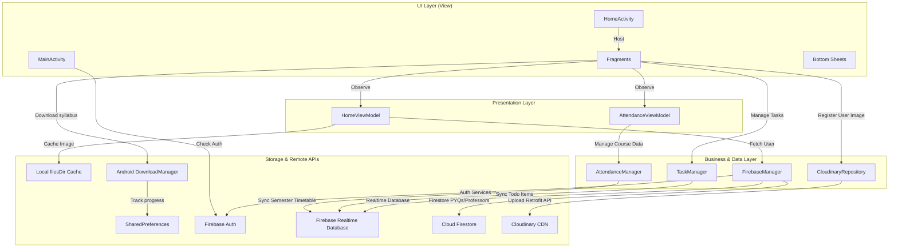

# INSEES (Instrumentation and Electronics Engineering Students' Society)


An academic utility and course organizer application for the **Instrumentation and Electronics Engineering Students' Society (INSEES)** of the **Electronics and Instrumentation Engineering (EIE) Department at NIT Silchar**. It streamlines academic course planning, target attendance monitoring (75% criteria), custom daily timetable tracking, task scheduling, resource sharing, and faculty directories.

---

## 📌 Table of Contents

* [Overview](#-overview)
* [Features](#-features)
  * [Authentication & Secure Onboarding](#authentication--secure-onboarding)
  * [Profile Management & Image Upload](#profile-management--image-upload)
  * [Attendance Tracker](#attendance-tracker)
  * [Class Timetable Scheduler](#class-timetable-scheduler)
  * [Priority-Driven Task Manager](#priority-driven-task-manager)
  * [Study Materials & Resource Drives](#study-materials--resource-drives)
  * [PDF Viewer & Download Manager](#pdf-viewer--download-manager)
  * [Faculty Directory](#faculty-directory)
  * [Repeating Reminders](#repeating-reminders)
* [Tech Stack](#-tech-stack)
* [Architecture & Data Design](#-architecture--data-design)
  * [Conceptual Data Model (Inferred from Codebase)](#conceptual-data-model-inferred-from-codebase)
  * [Mermaid Architecture Diagram](#mermaid-architecture-diagram)
* [Project Structure](#-project-structure)
* [Screenshots](#-screenshots)
* [Prerequisites](#-prerequisites)
* [Configuration](#-configuration)
* [Build Instructions](#-build-instructions)
* [Permissions](#-permissions)
* [Key Dependencies](#-key-dependencies)
* [Project Workflow](#-project-workflow)
* [Contributing](#-contributing)
* [Authors](#-authors)

---

## 📖 Overview

The EIE Department at NIT Silchar, established in 2008, offers B.Tech, M.Tech, and PhD programs. The **INSEES** app serves as a centralized hub for students to organize their academic duties and access department resources. It assists students in keeping track of their target attendance percentages, configuring individual semester schedules, managing assignments or projects, streaming study notes, and fetching details of faculty members.

---

## 🛠️ Features

### Authentication & Secure Onboarding
* **NIT Silchar Domain Restriction:** Registration is strictly restricted to NIT Silchar student email ids ending with `@ei.nits.ac.in`.
* **Security Checks:** Enforces account email verification during sign-up before granting access to dashboard operations.
* **Credentials Recovery:** Native password reset mechanism via Firebase Authentication.

### Profile Management & Image Upload
* **Custom Photo Capture:** Integrates with native Camera and Gallery applications via `ActivityResultLauncher` contracts to capture user profile pictures.
* **On-the-fly Image Compression:** Compresses bitmaps to JPEG format to save bandwidth.
* **Cloudinary Hosting:** Direct image upload to Cloudinary servers using multipart requests via a Retrofit client.
* **Smart Local Caching:** Saves fetched profile photos inside the app's internal storage directory (`context.filesDir/{uid}.jpg`). On startup, the app loads from the local cache rather than making unnecessary network downloads.

### Attendance Tracker
* **Semester-wise Monitoring:** Tracks and organizes theory and laboratory classes individually for all semesters (1 to 8).
* **Pre-seeded Syllabus:** Supports pre-seeding default subjects and labs to establish initial lists immediately.
* **Quick Stats Indicator:** Calculates attended/scheduled classes percentage.
* **Lecture & Lab Sorting:** Courses are sorted automatically to list lectures first, followed by laboratory classes, and then alphabetically by name.
* **Mathematical Safety Margins:** 
  * If attendance is **above 75%**, it calculates the maximum number of classes a student can safely miss (`maxMiss = (attended / 0.75 - scheduled).toInt()`).
  * If attendance is **below 75%**, it calculates the consecutive class count that a student must attend to cross the threshold (`mustAttend = 3 * scheduled - 4 * attended`).
* **Interactive dialogs:** Dialogs with plus/minus steppers to easily modify attended and scheduled class counts.
* **Reset Functions:** Resets attendance statistics back to zero without deleting custom course names.

### Class Timetable Scheduler
* **Day-wise Schedule:** Creates timetable entries (slots) by day of the week (Monday to Saturday) for the active semester.
* **Today's Class Tracker:** Displays today's schedule on the dashboard using a calendar-aware selector.
* **Quick Actions:** Offers "+1 Present" and "+1 Absent" quick-update buttons to immediately update course counts directly from the timetable dashboard.

### Priority-Driven Task Manager
* **Dual-Tab Organization:** Splits tasks between **Pending** and **Completed** sections. Users manage active tasks and schedule new ones in the Pending view, while the Completed view acts as an archive (with task creation disabled for a cleaner layout).
* **Priority & Category Classifications:** Organizes tasks by priority (High, Medium, Low) and academic categories (Assignment, Exam, Lab, Project, Other) for structured planning.
* **Dynamic Sorting & Filtering:** Offers spinner controls to filter tasks by priority or category, and sort them either chronologically (by due date/time) or by priority level (High -> Medium -> Low), with chronological sorting serving as a tie-breaker.
* **Tactile Swipe Gestures:** Integrates `ItemTouchHelper` gestures to complete tasks (swipe left) and delete tasks (swipe right). Swiping is optimized to prevent visual stickiness in the completed view.
* **Automatic Reminder Scheduling:** Creating a task schedules a system reminder notification using the device's alarm manager. The application validates input to prevent setting task deadlines in the past.
* **Empty State Handling:** Displays customized placeholder layouts (e.g. `🎉 No Pending Tasks` or `📭 No Completed Tasks`) when the active list is empty.

### Study Materials & Resource Drives
* **Firestore-driven Resource Mapping:** Connects with Firestore to read document configurations for Semesters 3-8, retrieving syllabus folders, Google Drive resource links, and PYQs.
* **Google Drive Redirects:** Fast redirection to shared student resource folders.

### PDF Viewer & Download Manager
* **Inline PDF Streaming:** Streams syllabus/PYQ PDF files from secure URLs using `android-pdf-viewer` without leaving the app.
* **Smooth Loading State:** The loading indicator automatically disappears once the document begins rendering.
* **Background Downloads:** Delegates PDF downloads to Android's system `DownloadManager` displaying progress tracking notifications.

### Faculty Directory
* **Grid Recycler View:** Fetches and displays a directory of department professors and core members, providing links to their academic website portfolios.
* **Interactive Actions:** Supports quick email redirection, phone dialers, and links to official profile portfolios.
* **Academic Utility:** Enables students to quickly contact department advisors regarding attendance issues, permissions, project reviews, or research queries.

### Repeating Reminders
* **Daily Attendance Alert:** Triggers an alarm notification at 5:00 PM daily to remind students to log their attendance.
* **Task Alerts:** Schedules exact alarm reminders for specific tasks using `AlarmManager`.

---

## 💻 Tech Stack

| Category | Technology / Library | Description |
|---|---|---|
| **Core Platform** | Android SDK (Min SDK: 24, Target SDK: 36) | Target build environment |
| **Language** | Kotlin 2.0.21 | Primary language |
| **Architecture** | Model-View-ViewModel (MVVM) | Structured view layer separation |
| **Authentication** | Firebase Authentication | Safe user registration and password recovery |
| **Realtime Sync** | Firebase Realtime Database | Syncs user attendance, timetable, and tasks |
| **Content Fetch** | Cloud Firestore | Manages PYQs links, resource drives, and professors directory |
| **Image Hosting** | Cloudinary CDN | Uploads and hosts profile images via Retrofit |
| **Networking** | Retrofit 2.11.0 / OkHttp 4.12.0 | HTTP client for image uploads |
| **Image Loading** | Glide 4.16.0 / Coil 2.6.0 | Downloads and caches network images |
| **View rendering** | ViewBinding / Android XML Layouts | UI construction |
| **PDF Viewer** | `android-pdf-viewer:3.2.0-beta.3` | Inline PDF rendering from stream |
| **Alert/Alarms** | `AlarmManager` & `BroadcastReceiver` | Exact task alerts and repeating daily reminders |

---

## 📐 Architecture & Data Design

The application utilizes a clean **Model-View-ViewModel (MVVM)** architecture. Activities act as NavHost containers that coordinate fragments using the Jetpack Navigation Component.

### Conceptual Data Model (Inferred from Codebase)

User metrics and scheduling parameters are saved in a structured, hierarchical JSON structure isolated under each user's unique UID:

```json
{
  "users": {
    "USER_UID": {
      "name": "Student Name",
      "profilePhoto": "https://res.cloudinary.com/dhmftd2zq/image/upload/...",
      "activeSemester": 1,
      "Attendance": {
        "Sem_1": {
          "SUBJECT_ID": {
            "id": "SUBJECT_ID",
            "name": "Subject Name",
            "isLab": false,
            "classesAttended": 15,
            "classesScheduled": 20
          }
        }
      },
      "Timetable": {
        "Sem_1": {
          "Monday": {
            "SLOT_ID": {
              "id": "SLOT_ID",
              "subjectId": "SUBJECT_ID",
              "subjectName": "Subject Name",
              "dayOfWeek": "Monday",
              "time": "09:00 AM - 10:00 AM"
            }
          }
        }
      },
      "Tasks": {
        "TASK_ID": {
          "id": "TASK_ID",
          "title": "Task Title",
          "description": "Task description details",
          "date": "dd/MM/yyyy",
          "time": "HH:mm",
          "status": "Pending",
          "createdAt": 1782795866,
          "priority": "High",
          "category": "Assignment"
        }
      }
    }
  }
}
```

### Mermaid Architecture Diagram



* **UI Layer:** Implemented using standard fragments (`HomeFragment`, `AttendanceFragment`, `TodoFragment`) styled via Android XML layouts and custom drawables.
* **Presentation Layer:** `HomeViewModel` and `AttendanceViewModel` use lifecycle-aware `LiveData` observers to bridge data updates to views.
* **Business Layer:** Core database interactions are encapsulated in singleton managers (`AttendanceManager`, `TaskManager`).
* **Data Sources:** Data flows between Cloud API resources (Firebase, Cloudinary) and local repositories, using internal storage files (`filesDir`) and `SharedPreferences` for localized caching.

---

## 📂 Project Structure

### High-Level Folder Structure

```text
INSEES
├── app
│   ├── src/main
│   │   ├── AndroidManifest.xml
│   │   ├── java/com/example/insees
│   │   │   ├── activity          # Main and Home Activity entry points
│   │   │   ├── fragment          # Modular MVVM UI screens
│   │   │   ├── adapter           # Custom RecyclerView lists & ViewPager adapters
│   │   │   ├── model             # JSON model mappings for Realtime DB/Firestore
│   │   │   ├── network           # Cloudinary REST API Retrofit interfaces
│   │   │   └── util              # Singletons (Attendance, Task, Notifications, Alarms)
│   │   └── res                   # Layouts, themes, colors, and navigation graphs
│   └── build.gradle.kts          # Module dependency configurations
├── gradle/libs.versions.toml     # Dependency version catalog
└── build.gradle.kts              # Root gradle project configurations
```

<details>
<summary><b>Click to expand full repository directory tree</b></summary>

```text
INSEES
|-- .gitignore
|-- .kotlin
|   |-- errors
|   |   |-- errors-1781899082896.log
|   |   `-- errors-1781902381660.log
|   `-- sessions
|-- app
|   |-- .gitignore
|   |-- build.gradle.kts
|   |-- google-services.json
|   |-- proguard-rules.pro
|   |-- sampledata
|   `-- src
|       |-- androidTest
|       |   `-- java
|       |       `-- com
|       |           `-- example
|       |               `-- insees
|       |                   `-- ExampleInstrumentedTest.kt
|       |-- main
|       |   |-- AndroidManifest.xml
|       |   |-- ic_logo-playstore.png
|       |   |-- java
|       |   |   `-- com
|       |   |       `-- example
|       |   |           `-- insees
|       |   |               |-- activity
|       |   |               |   |-- HomeActivity.kt
|       |   |               |   |-- InseesApplication.kt
|       |   |               |   `-- MainActivity.kt
|       |   |               |-- adapter
|       |   |               |   |-- AttendanceSubjectAdapter.kt
|       |   |               |   |-- GridRVAdapter.kt
|       |   |               |   |-- HomeToDoAdapter.kt
|       |   |               |   |-- ProfessorAdapter.kt
|       |   |               |   |-- SemesterAdapter.kt
|       |   |               |   |-- TimetableSlotAdapter.kt
|       |   |               |   |-- ToDoAdapter.kt
|       |   |               |   |-- ViewPagerAdapter.kt
|       |   |               |   `-- YearAdapter.kt
|       |   |               |-- bottomSheetDialog
|       |   |               |   |-- AishwaryaFragment.kt
|       |   |               |   `-- ShreyaFragment.kt
|       |   |               |-- fragment
|       |   |               |   |-- AboutDevelopersFragment.kt
|       |   |               |   |-- AboutMembersFragment.kt
|       |   |               |   |-- AttendanceFragment.kt
|       |   |               |   |-- CompleteProfileFragment.kt
|       |   |               |   |-- ForgotPasswordFragment.kt
|       |   |               |   |-- HomeFragment.kt
|       |   |               |   |-- InseesAboutInseesFragment.kt
|       |   |               |   |-- InseesAboutUsFragment.kt
|       |   |               |   |-- IntroFragment.kt
|       |   |               |   |-- LoginFragment.kt
|       |   |               |   |-- PdfViewerFragment.kt
|       |   |               |   |-- PopUpFragments.kt
|       |   |               |   |-- SemesterFragment.kt
|       |   |               |   |-- SignUpFragment.kt
|       |   |               |   |-- TimetableFragment.kt
|       |   |               |   |-- TodoFragment.kt
|       |   |               |   |-- ViewPagerFragment.kt
|       |   |               |   `-- YearFragment.kt
|       |   |               |-- model
|       |   |               |   |-- AttendanceSubject.kt
|       |   |               |   |-- Professors.kt
|       |   |               |   |-- Semester.kt
|       |   |               |   |-- TimetableSlot.kt
|       |   |               |   |-- ToDoData.kt
|       |   |               |   `-- member.kt
|       |   |               |-- network
|       |   |               |   |-- CloudinaryApi.kt
|       |   |               |   |-- CloudinaryRepository.kt
|       |   |               |   |-- RetrofitClient.kt
|       |   |               |   `-- UploadResponse.kt
|       |   |               |-- ui
|       |   |               |   `-- theme
|       |   |               |       |-- Color.kt
|       |   |               |       |-- Theme.kt
|       |   |               |       `-- Type.kt
|       |   |               `-- util
|       |   |                   |-- AttendanceManager.kt
|       |   |                   |-- AttendanceViewModel.kt
|       |   |                   |-- CloudinaryConstants.kt
|       |   |                   |-- DialogAddBtnClickListener.kt
|       |   |                   |-- DownloadProgressUpdater.kt
|       |   |                   |-- FirebaseManager.kt
|       |   |                   |-- HomeViewModel.kt
|       |   |                   |-- NotificationReceiver.kt
|       |   |                   |-- ReminderHelper.kt
|       |   |                   |-- Swipe.kt
|       |   |                   `-- TaskManager.kt
|       |   `-- res
|       |       |-- color
|       |       |   `-- nav_bar_color.xml
|       |       |-- drawable
|       |       |-- font
|       |       |-- layout
|       |       |-- menu
|       |       |-- mipmap-anydpi-v26
|       |       |-- mipmap-hdpi
|       |       |-- mipmap-mdpi
|       |       |-- mipmap-xhdpi
|       |       |-- mipmap-xxhdpi
|       |       |-- mipmap-xxxhdpi
|       |       |-- navigation
|       |       |   |-- nav_graph.xml
|       |       |   `-- nav_graph_home.xml
|       |       |-- values
|       |       |   |-- colors.xml
|       |       |   |-- font_certs.xml
|       |       |   |-- ic_logo_background.xml
|       |       |   |-- ic_userr_background.xml
|       |       |   |-- preloaded_fonts.xml
|       |       |   |-- strings.xml
|       |       |   `-- themes.xml
|       |       |-- values-night
|       |       `-- xml
|       `-- test
|           `-- java
|               `-- com
|                   `-- example
|                       `-- insees
|                           `-- ExampleUnitTest.kt
|-- build.gradle.kts
|-- gradle
|   |-- libs.versions.toml
|   `-- wrapper
|       |-- gradle-wrapper.jar
|       `-- gradle-wrapper.properties
|-- gradle.properties
|-- gradlew
|-- gradlew.bat
|-- ic_userr-playstore.png
|-- local.properties
`-- settings.gradle.kts
```
</details>

---

## 📸 Screenshots

> **Note:** Screenshots will be added later.

### Landing / Onboarding Screen


### Sign Up Screen


### Complete Profile Screen


### Login Screen


### Forgot Password Screen


### Main Dashboard Screen


### Navigation Drawer


### Attendance Tracker Screen


### Class Timetable Screen


### Task Manager (Todo Screen)


### Study Materials (Semester List) Screen


### Semester Drive & PYQs Screen


### PDF Viewer Screen


### About Department Screen


### About Developers & Members Tab Screen


---

## 📋 Prerequisites

* **Android Studio:** Jellyfish / Koala or newer recommended.
* **JDK:** Java 17 configured in Android Studio build settings.
* **Android Device/Emulator:** API Level 24 (Nougat) or newer.

---

## 🔧 Configuration

<details>
<summary><b>Click to expand environment & Firebase setup guide</b></summary>

### 1. Firebase setup
1. Register a new project on the [Firebase Console](https://console.firebase.google.com/).
2. Add an Android application with package identifier `com.example.insees`.
3. Download the configuration file `google-services.json` and place it in the `app/` directory of the project.
4. **Firebase Services Configuration:**
   * **Authentication:** Enable **Email/Password** sign-in providers.
   * **Realtime Database:** Create a database instance in your region and configure rules to allow read/writes for authenticated users.
   * **Cloud Firestore:** Enable Firestore Database and initialize collections named `PYQs` and `Professors`.

### 2. Cloudinary integration
The application communicates with a specific Cloudinary storage space to upload user profile photos.
1. Sign up on [Cloudinary](https://cloudinary.com/) and navigate to your dashboard settings.
2. In `app/src/main/java/com/example/insees/network/RetrofitClient.kt`, the Base URL is set to:
   ```kotlin
   baseUrl("https://api.cloudinary.com/v1_1/YOUR_CLOUD_NAME/")
   ```
3. Configure a signed/unsigned **Upload Preset** named `insees_profile_v2` in your Cloudinary upload settings, routing uploads to the directory folder path `insees/profile`.
</details>

---

## 🚀 Build Instructions

### Building via Android Studio
1. Open Android Studio and select **File > Open**.
2. Select the root directory containing the cloned project.
3. Allow Gradle to sync dependencies and configuration properties.
4. Select **Run > Run 'app'** or use the shortcut key `Shift + F10` to deploy to a connected device.

### Building via CLI
Open a terminal in the root project folder:
```bash
# Clean the project
./gradlew clean

# Build a debug APK
./gradlew assembleDebug
```
The output APK will be generated at `app/build/outputs/apk/debug/app-debug.apk`.

---

## 🔑 Permissions

The application requests the following system permissions declared in [AndroidManifest.xml](file:///C:/Users/shrey/AndroidStudioProjects/INSEES/app/src/main/AndroidManifest.xml):

| Permission Name | Max SDK | Purpose |
|---|---|---|
| `android.permission.INTERNET` | - | Syncs Realtime Database data, queries Firestore, and uploads images to Cloudinary. |
| `android.permission.CAMERA` | - | Enables the camera capture interface to snap user profile photos. |
| `android.permission.POST_NOTIFICATIONS` | - | Renders system alarms and daily attendance reminder notifications (required on Android 13+). |
| `android.permission.READ_EXTERNAL_STORAGE` | 32 | Accesses device gallery to select profile photos. |
| `android.permission.WRITE_EXTERNAL_STORAGE` | 32 | Caches photo bytes locally and writes downloaded files to external downloads directory. |
| `android.permission.SCHEDULE_EXACT_ALARM` | - | Instructs AlarmManager to schedule precise reminders for upcoming tasks. |
| `android.permission.USE_EXACT_ALARM` | - | Required system alarm dispatcher mechanism on newer Android frameworks. |
| `android.permission.RECEIVE_BOOT_COMPLETED` | - | Listens for system restart events to restore alarms. |

---

## 📦 Key Dependencies

All dependency declarations are defined in [libs.versions.toml](file:///C:/Users/shrey/AndroidStudioProjects/INSEES/gradle/libs.versions.toml) and imported in the [app/build.gradle.kts](file:///C:/Users/shrey/AndroidStudioProjects/INSEES/app/build.gradle.kts):

* **Android Jetpack Component Libraries:**
  * **Navigation Component (`navigation-fragment-ktx` / `navigation-ui-ktx`):** Manages fragments transitions.
  * **ConstraintLayout:** Constructs complex, responsive layouts with flat view hierarchies.
  * **Lifecycle Ktx (`lifecycle-runtime-ktx`):** Coordinates coroutine scopes bound to UI lifecycles.
* **Firebase Services:**
  * **Firebase Auth:** Handles secure user registration and login state.
  * **Firebase Realtime Database:** Stores course tracking items, active semester, and user to-do lists.
  * **Cloud Firestore:** Pulls department members and drive resources.
* **HTTP Networking Stack:**
  * **Retrofit 2.11.0:** Formulates API call structures.
  * **OkHttp 4.12.0:** Manages HTTP pipelines, featuring logging interceptors for API diagnostics.
* **Image Management:**
  * **Glide 4.16.0:** Handles image loading, decoding, and caching.
  * **Coil 2.6.0:** Supporting lightweight image loading framework.
  * **CircleImageView:** Renders profile icons in circular formats.
* **Document Rendering:**
  * **Android PDF Viewer:** Streams and renders PDF files inline.

---

## 🔄 Project Workflow

1. **Onboarding check (`MainActivity`):**
   * The app checks if a user session is active (`FirebaseAuth.currentUser != null`) and verified (`isEmailVerified == true`).
   * If yes, the user is forwarded to `HomeActivity`. If not, `MainActivity` mounts `IntroFragment`.
2. **Onboarding Flows (`IntroFragment` / `SignUpFragment` / `CompleteProfileFragment`):**
   * New users must sign up using an email address ending in `@ei.nits.ac.in`.
   * On validation, `CompleteProfileFragment` requests profile photo details (via Camera/Gallery contract) and uploads the file to Cloudinary.
   * On upload completion, user settings (name and profile URL) are stored under `/users/{uid}` in the Realtime Database and a verification link is sent.
3. **Core Dashboard View (`HomeFragment`):**
   * Greets users, downloads/caches their profile photo locally (`filesDir`), displays quick navigation buttons, and maps the top 2 upcoming tasks.
4. **Attendance Calculation Flow (`AttendanceFragment`):**
   * Pulls subject records (`classesAttended`, `classesScheduled`).
   * Evaluates overall status:
     * If total percentage >= 75%: Calculates how many future classes the student can safely skip.
     * If total percentage < 75%: Warns the student of the exact count of consecutive classes they must attend to restore their status.
5. **Class scheduling Flow (`TimetableFragment`):**
   * Users add class schedule parameters. On class days, today's slots are populated directly on the tracker view, offering immediate Present/Absent updates.
6. **Task Creation and Alarm Dispatching (`PopUpFragment` / `TodoFragment`):**
   * Adding a task opens the `PopUpFragment` bottom sheet. The app validates that the deadline is in the future.
   * On validation, it uploads the task data to `/users/{uid}/Tasks/{taskId}` (status is set to `"Pending"`).
   * Simultaneously, it calls the `ReminderHelper` to schedule an exact alarm reminder in the system's `AlarmManager`.
   * Swiping a task left completes it, changing the remote status to `"Completed"`, which removes the task from the pending tab. Swiping a task right deletes the task entirely and removes it from Firebase.

---

## 🤝 Contributing

Contributions to improve the application are welcome! Please follow these guidelines:
1. Fork the repository and create your feature branch: `git checkout -b feature/NewFeature`.
2. Commit your modifications with descriptive explanations.
3. Verify your project compiles successfully without Gradle lint or syntax errors.
4. Push your modifications to your fork and submit a Pull Request.

---

## ✍️ Authors

* **Shreya Tripathi** - [GitHub](https://github.com/Shreya191191) | [LinkedIn](https://www.linkedin.com/in/shreya-tripathi-10a1b328a/)
* **Aishwarya Shukla** - [GitHub](https://github.com/Aishwarya191sh) | [LinkedIn](https://www.linkedin.com/in/aishwarya-shukla-1b733a2a9/)
